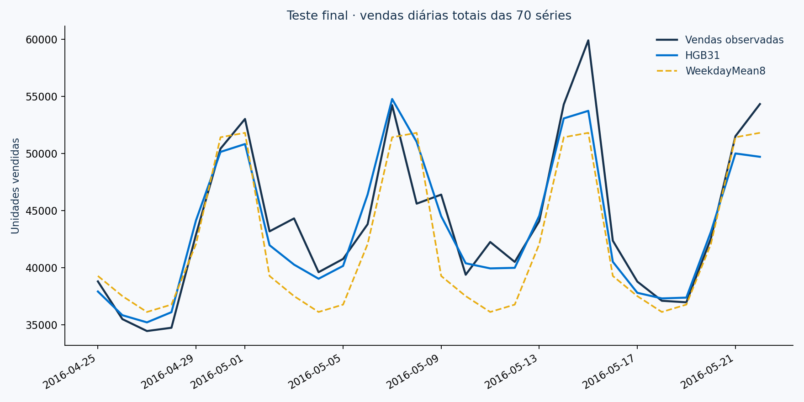

# DemandScope · Previsão de vendas em 28 dias


**Como prever vendas por loja e departamento para apoiar planejamento de reposição?**

Projeto de séries temporais com dados reais **Walmart/M5**, desenvolvido por **Lucas Menghi** com assistência de IA. Fluxo CRISP-DM, oito candidatos, quatro origens de backtesting, teste final separado, intervalos empíricos e apresentação executiva corporativa em português e inglês.

**Resultado histórico:** HistGradientBoosting alcançou WAPE de **9,99%**, contra **12,05%** da referência escolhida no desenvolvimento: redução relativa de **17,1%** no erro do teste. Isso não representa redução de estoque, economia ou ROI realizado.

## Resultados executados

| Indicador | Teste final |
|---|---:|
| Séries loja–departamento | 70 |
| Horizonte | 28 dias |
| Período | 25/04/2016–22/05/2016 |
| Modelo selecionado | HGB31 · HistGradientBoosting |
| WAPE | 9,99% |
| MAE por série–dia | 62.78 unidades |
| Viés no total | -1,29% |
| RMSSE médio entre séries | 0.791 |
| Cobertura do intervalo nominal 90% | 91,4% |



## Comparação de modelos

Seleção pela média do WAPE em quatro janelas de 28 dias. Não se escolhe o modelo pelo teste final. Todas as dez lojas e sete departamentos são incluídos.

| Modelo | WAPE médio desenvolvimento | RMSSE médio |
|---|---:|---:|
| HGB31 | 11,46% | 0.814 |
| HGB15 | 11,48% | 0.818 |
| Ridge100 | 12,58% | 0.861 |
| Ridge10 | 12,58% | 0.861 |
| WeekdayMean8 | 13,48% | 0.884 |
| ETS | 13,70% | 0.902 |
| ETSLog | 15,96% | 0.960 |
| SeasonalNaive7 | 16,62% | 1.094 |

SeasonalNaive7 repete a última semana; WeekdayMean8 calcula a média do mesmo dia da semana nas últimas oito semanas. ETS usa tendência amortecida e sazonalidade semanal, com/sem log. Ridge e HistGradientBoosting são globais, com defasagens seguras para todo o horizonte de 28 dias.

## Estudo e notebook

- [Estudo executivo · português](https://lucasmenghi.github.io/portifolio/projects/demandscope.html)
- [Executive case study · English](https://lucasmenghi.github.io/portifolio/projects/demandscope-en.html)
- [Notebook CRISP-DM executado](notebooks/01_demandscope.ipynb)
- [Model card](docs/model_card.md) · [Protocolo anterior à execução](docs/protocol.md) · [Dados e contrato batch](docs/data_dictionary.md)

## Reproduzir

Python 3.11. Ambiente executado em `reports/environment.json`.

```bash
python -m venv .venv
# Ative o ambiente virtual conforme seu sistema.
pip install -r requirements.txt
python scripts/download_data.py
python scripts/train.py
pytest -q
python scripts/build_docs.py
python scripts/build_notebook.py
streamlit run app.py
```

O download usa o espelho público documentado da Nixtla. Fonte original e regras: [Kaggle M5](https://www.kaggle.com/competitions/m5-forecasting-accuracy/data). Organizadores: [Mcompetitions](https://github.com/Mcompetitions/M5-methods). Hashes e diferenças de esquema documentadas em `reports/data_manifest.json`. Nenhum dado fictício substitui silenciosamente a fonte real.

### Inferência de 28 dias

```bash
python scripts/export_panel.py
python scripts/predict.py data/processed/history.csv data/processed/calendar.csv predictions.csv
```

Exige história diária completa das 70 séries e calendário futuro. Não usa valores reais durante o horizonte. Artefato treinado até 24/04/2016; os exemplos são históricos, sem previsão atual de Walmart. Nunca carregue joblib de fonte não confiável.

## Estrutura

```text
src/          Dados, features, modelos, métricas e intervalos
scripts/      Download, treino, inferência, notebook e documentação
notebooks/    CRISP-DM com saídas executadas
artifacts/    Estimador e configuração congelados antes do teste
reports/      Procedência, folds, comparação, métricas e gráficos
docs/         Protocolo, model card, contrato e estudo bilíngue
assets/       Capa executiva corporativa gerada com IA
tests/        Vazamento temporal, calendário, sazonalidade e inferência
app.py        Dashboard Streamlit de resultados agregados
```

## Limites

Vendas observadas não equivalem a demanda latente: sem estoque e rupturas, não medimos demanda perdida. Sem lead times, margem e custos, não calculamos reposição ótima ou economia. Horizonte de 28 dias, base histórica de 2011–2016, apenas quatro origens e um teste final; generalização para outras épocas/empresas exige validação.

Os intervalos são calibrados empiricamente por departamento nos resíduos de desenvolvimento. Seleção e calibração compartilham janelas; dependência temporal limita garantias. Não somamos intervalos individuais para alegar cobertura de totais. O recorte de 70 séries não usa o WRMSSE completo dos 12 níveis M5; nenhuma colocação na competição é reivindicada.

Código original sob MIT. Dados e artefatos derivados preservam condições da fonte M5; não distribuímos arquivos brutos ou histórico por item. Sem vínculo ou endosso de Walmart/Nixtla e sem aprovação produtiva. Arte conceitual gerada com IA; gráficos e números calculados de verdade.
